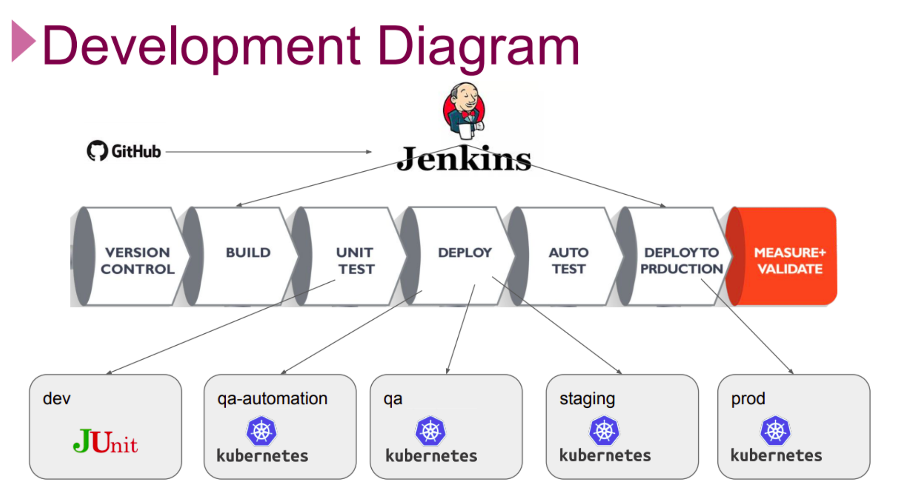

# Distributed version of the Spring PetClinic Sample Application built with Spring Cloud 

[](https://travis-ci.org/spring-petclinic/spring-petclinic-microservices/) [](https://opensource.org/licenses/Apache-2.0)

This microservices branch was initially derived from [AngularJS version](https://github.com/spring-petclinic/spring-petclinic-angular1) to demonstrate how to split sample Spring application into [microservices](http://www.martinfowler.com/articles/microservices.html). To achieve that goal we used [Spring Cloud Netflix](https://github.com/spring-cloud/spring-cloud-netflix) technology stack.

## DevOps Pipelines

### Development Diagram



### Pipelines Configurations


### Pipelines Overview


## Flow of Tasks for Project Realization

| Epic | Task  | Task #  | Task Definition   | Branch  |
| ---   | :---  | ---                  | :---              | :---    |
| Local Development Environment | Prepare Development Server Manually on EC2 Instance| MSP-1 | Prepare development server manually on Amazon Linux 2 for developers, enabled with `Docker` , `Docker-Compose` , `Java 11` , `Git` .  |
| Local Development Environment | Prepare GitHub Repository for the Project | MSP-2-1 | Clone the Petclinic app from the Clarusway repository [Petclinic Microservices Application](https://github.com/clarusway/petclinic-microservices.git) |
| Local Development Environment | Prepare GitHub Repository for the Project | MSP-2-2 | Prepare base branches namely `main` , `dev` , `release` for DevOps cycle. |
| Local Development Environment | Check the Maven Build Setup on Dev Branch | MSP-3 | Check the Maven builds for `test` , `package` , and `install` phases on `dev` branch |
| Local Development Environment | Prepare a Script for Packaging the Application | MSP-4 |  Prepare a script to package the application with Maven wrapper | feature/msp-4 |
| Local Development Environment | Prepare Development Server Terraform Files | MSP-5 |  Prepare development server folder with Terraform File for developers, enabled with `Docker` , `Docker-Compose` , `Java 11` , `Git` . | feature/msp-5 |
| Local Development Build | Prepare Dockerfiles for Microservices | MSP-6 | Prepare Dockerfiles for each microservices. | feature/msp-6 |
| Local Development Environment | Prepare Script for Building Docker Images | MSP-7 |  Prepare a script to package and build the docker images for all microservices. | feature/msp-7 |
| Local Development Build | Create Docker Compose File for Local Development | MSP-8-1 |  Prepare docker compose file to deploy the application locally. | feature/msp-8 |
| Local Development Build | Create Docker Compose File for Local Development | MSP-8-2 |  Prepare a script to test the deployment of the app locally. | feature/msp-8 |
| CI Server Setup | Prepare Jenkins Server | MSP-9 | Prepare Jenkins Server for CI/CD Pipeline. | feature/msp-9 |
| CI Server Setup | Configure Jenkins Server for Project | MSP-10  | Configure Jenkins Server for Project Setup. | 
| Testing Environment Setup | Implement Unit Tests | MSP-11-1  | Implement 3 Unit Tests locally. | feature/msp-11 |
| Testing Environment Setup | Setup Code Coverage Tool | MSP-11-2  | Update POM file for Code Coverage Report. | feature/msp-11 |
| Testing Environment Setup | Implement Code Coverage | MSP-11-3  | Generate Code Coverage Report manually. | feature/msp-11 |
| CI Server Setup | Prepare CI Pipeline | MSP-12 | Prepare CI pipeline (UT only) for all `dev` , `feature` and `bugfix` branches. | feature/msp-1 |
| Testing Environment Setup | Prepare Selenium Tests | MSP-13-1  | Prepare 3 Selenium Jobs for QA Automation Tests. | feature/msp-13 |
| Testing Environment Setup | Implement Selenium Tests | MSP-13-2  | Run 3 Selenium Tests against local environment. | feature/msp-13 |
| Registry Setup for Development | Create Docker Registry for Dev Manually | MSP-14  | Create Docker Registry on AWS ECR manually using Jenkins job. | feature/msp-14 |
| QA Automation Setup for Development | Create a QA Automation Environment - Part-1 | MSP-15  | Create a QA Automation Environment with Kubernetes. | feature/msp-15 |
| QA Automation Setup for Development | Create a QA Automation Environment - Part-2 | MSP-16  | Create a QA Automation Environment with Kubernetes. | feature/msp-16 |
| QA Automation Setup for Development | Prepare Petlinic Kubernetes YAML Files | MSP-17  | Prepare Petlinic Kubernetes YAML Files. | feature/msp-17 |
| QA Automation Setup for Development | Prepare a QA Automation Pipeline | MSP-18  | Prepare a QA Automation Pipeline on `dev` branch for Nightly Builds. | feature/msp-18 |
| QA Setup for Release | Create a QA Infrastructure with eksctl | MSP-19  | Create a Permanent QA Infrastructure for Kubernetes Cluster with eksctl. | feature/msp-19 |
| QA Setup for Release | Prepare Build Scripts for QA Environment | MSP-20  | Prepare Build Scripts for QA Environment | feature/msp-20 |
| QA Setup for Release | Build and Deploy App on QA Environment Manually | MSP-21  | Build and Deploy App for QA Environment Manually using Jenkins Jobs. | feature/msp-21 | 
| QA Setup for Release | Prepare a QA Pipeline | MSP-22  | Prepare a QA Pipeline using Jenkins on `release` branch for Weekly Builds. | feature/msp-22 |
| Staging and Production Setup | Prepare HA RKE Kubernetes Cluster | MSP-23  | Prepare High-availability RKE Kubernetes Cluster on AWS EC2 | feature/msp-23 |
| Staging and Production Setup | Install Rancher App on RKE K8s Cluster | MSP-24  | Install Rancher App on RKE Kubernetes Cluster| |
| Staging and Production Setup | Create Staging and Production Environment with Rancher | MSP-25  | Create Staging and Production Environment with Rancher by creating new cluster for Petclinic | |
| Staging Deployment Setup | Prepare and Configure Nexus Server | MSP-26  | Create and Configure Nexus Server for Pipelines | feature/msp-26|
| Staging Deployment Setup | Prepare a Staging Pipeline | MSP-27  | Prepare a Staging Pipeline on Jenkins Server | feature/msp-27|
| Production Deployment Setup | Prepare a Production Pipeline | MSP-28  | Prepare a Production Pipeline on Jenkins Server | feature/msp-28|
| Production Deployment Setup | Set Domain Name and TLS for Production | MSP-29  | Set Domain Name and TLS for Production Pipeline with Route 53 | feature/msp-29|
| Production Deployment Setup | Set Monitoring Tools | MSP-30  | Set Monitoring tools, Prometheus and Grafana | |

## Starting services locally without Docker
Every microservice is a Spring Boot application and can be started locally using IDE or `../mvnw spring-boot:run` command. Please note that supporting services (Config and Discovery Server) must be started before any other application (Customers, Vets, Visits and API).
Startup of Tracing server, Admin server, Grafana and Prometheus is optional.
If everything goes well, you can access the following services at given location:
* Discovery Server - http://localhost:8761
* Config Server - http://localhost:8888
* AngularJS frontend (API Gateway) - http://localhost:8080
* Customers, Vets and Visits Services - random port, check Eureka Dashboard 
* Tracing Server (Zipkin) - http://localhost:9411/zipkin/ (we use [openzipkin](https://github.com/openzipkin/zipkin/tree/master/zipkin-server))
* Admin Server (Spring Boot Admin) - http://localhost:9090
* Grafana Dashboards - http://localhost:3000
* Prometheus - http://localhost:9091
* Hystrix Dashboard for Circuit Breaker pattern - http://localhost:7979 - On the home page is a form where you can enter 
the URL for an event stream to monitor, for example the `api-gateway` service running locally: `http://localhost:8080/actuator/hystrix.stream` 
or running into docker: `http://api-gateway:8080/actuator/hystrix.stream`


You can tell Config Server to use your local Git repository by using `local` Spring profile and setting
`GIT_REPO` environment variable, for example:
`-Dspring.profiles.active=local -DGIT_REPO=/projects/spring-petclinic-microservices-config`

## Starting services locally with docker-compose
In order to start entire infrastructure using Docker, you have to build images by executing `./mvnw clean install -PbuildDocker` 
from a project root. Once images are ready, you can start them with a single command
`docker-compose up`. Containers startup order is coordinated with [`dockerize` script](https://github.com/jwilder/dockerize). 
After starting services it takes a while for API Gateway to be in sync with service registry,
so don't be scared of initial Zuul timeouts. You can track services availability using Eureka dashboard
available by default at http://localhost:8761.

*NOTE: Under MacOSX or Windows, make sure that the Docker VM has enough memory to run the microservices. The default settings
are usually not enough and make the `docker-compose up` painfully slow.*

## Understanding the Spring Petclinic application

[See the presentation of the Spring Petclinic Framework version](http://fr.slideshare.net/AntoineRey/spring-framework-petclinic-sample-application)

[A blog bost introducing the Spring Petclinic Microsevices](http://javaetmoi.com/2018/10/architecture-microservices-avec-spring-cloud/) (french language)

You can then access petclinic here: http://localhost:8080/


**Architecture diagram of the Spring Petclinic Microservices**


## In case you find a bug/suggested improvement for Spring Petclinic Microservices

Our issue tracker is available here: https://github.com/spring-petclinic/spring-petclinic-microservices/issues

## Database configuration

In its default configuration, Petclinic uses an in-memory database (HSQLDB) which gets populated at startup with data.
A similar setup is provided for MySql in case a persistent database configuration is needed.
Dependency for Connector/J, the MySQL JDBC driver is already included in the `pom.xml` files.

### Start a MySql database

You may start a MySql database with docker:

```
docker run -e MYSQL_ROOT_PASSWORD=petclinic -e MYSQL_DATABASE=petclinic -p 3306:3306 mysql:5.7.8
```
or download and install the MySQL database (e.g., MySQL Community Server 5.7 GA), which can be found here: https://dev.mysql.com/downloads/

### Use the Spring 'mysql' profile

To use a MySQL database, you have to start 3 microservices (`visits-service`, `customers-service` and `vets-services`)
with the `mysql` Spring profile. Add the `--spring.profiles.active=mysql` as programm argument.

By default, at startup, database schema will be created and data will be populated.
You may also manualy create the PetClinic database and data by executing the `"db/mysql/{schema,data}.sql"` scripts of each 3 microservices. 
In the `application.yml` of the [Configuration repository], set the `initialization-mode` to `never`.

If you are running the microservices with Docker, you have to add the `mysql` profile into the (Dockerfile)[docker/Dockerfile]:
```
ENV SPRING_PROFILES_ACTIVE docker,mysql
```
In the `mysql section` of the `application.yml` from the [Configuration repository], you have to change 
the host and port of your MySQL JDBC connection string. 

## Custom metrics monitoring

Grafana and Prometheus are included in the `docker-compose.yml` configuration, and the public facing applications
have been instrumented with [MicroMeter](https://micrometer.io) to collect JVM and custom business metrics.

A JMeter load testing script is available to stress the application and generate metrics: [petclinic_test_plan.jmx](spring-petclinic-api-gateway/src/test/jmeter/petclinic_test_plan.jmx)


### Using Prometheus

* Prometheus can be accessed from your local machine at [http://localhost:9091]()

### Using Grafana with Prometheus

* An anonymous access and a Prometheus datasource are setup.
* A `Spring Petclinic Metrics` Dashboard is available at the URL [http://localhost:3000/d/69JXeR0iw/spring-petclinic-metrics]().
You will find the JSON configuration file here: [docker/grafana/dashboards/grafana-petclinic-dashboard.json]().
* You may create your own dashboard or import the [Micrometer/SpringBoot dashboard](https://grafana.com/dashboards/4701) via the Import Dashboard menu item.
The id for this dashboard is `4701`.

### Custom metrics

Spring Boot registers a lot number of core metrics: JVM, CPU, Tomcat, Logback... 
The Spring Boot auto-configuration enables the instrumentation of requests handled by Spring MVC.
All those three REST controllers `OwnerResource`, `PetResource` and `VisitResource` have been instrumented by the `@Timed` Micrometer annotation at class level.

* `customers-service` application has the following custom metrics enabled:
  * @Timed: `petclinic.owner`
  * @Timed: `petclinic.pet`
* `visits-service` application has the following custom metrics enabled:
  * @Timed: `petclinic.visit`

## Looking for something in particular?

| Spring Cloud components         | Resources  |
|---------------------------------|------------|
| Configuration server            | [Config server properties](spring-petclinic-config-server/src/main/resources/application.yml) and [Configuration repository] |
| Service Discovery               | [Eureka server](spring-petclinic-discovery-server) and [Service discovery client](spring-petclinic-vets-service/src/main/java/org/springframework/samples/petclinic/vets/VetsServiceApplication.java) |
| API Gateway                     | [Zuul reverse proxy](spring-petclinic-api-gateway/src/main/java/org/springframework/samples/petclinic/api/ApiGatewayApplication.java) and [Routing configuration](https://github.com/spring-petclinic/spring-petclinic-microservices-config/blob/master/api-gateway.yml) |
| Docker Compose                  | [Spring Boot with Docker guide](https://spring.io/guides/gs/spring-boot-docker/) and [docker-compose file](docker-compose.yml) |
| Circuit Breaker                 | [Hystrix fallback method](spring-petclinic-api-gateway/src/main/java/org/springframework/samples/petclinic/api/application/VisitsServiceClient.java)  |
| Grafana / Prometheus Monitoring | [Micrometer implementation](https://micrometer.io/), [Spring Boot Actuator Production Ready Metrics] |

 Front-end module  | Files |
|-------------------|-------|
| Node and NPM      | [The frontend-maven-plugin plugin downloads/installs Node and NPM locally then runs Bower and Gulp](spring-petclinic-ui/pom.xml)  |
| Bower             | [JavaScript libraries are defined by the manifest file bower.json](spring-petclinic-ui/bower.json)  |
| Gulp              | [Tasks automated by Gulp: minify CSS and JS, generate CSS from LESS, copy other static resources](spring-petclinic-ui/gulpfile.js)  |
| Angular JS        | [app.js, controllers and templates](spring-petclinic-ui/src/scripts/)  |


## Interesting Spring Petclinic forks

The Spring Petclinic master branch in the main [spring-projects](https://github.com/spring-projects/spring-petclinic)
GitHub org is the "canonical" implementation, currently based on Spring Boot and Thymeleaf.

This [spring-petclinic-microservices](https://github.com/spring-petclinic/spring-petclinic-microservices/) project is one of the [several forks](https://spring-petclinic.github.io/docs/forks.html) 
hosted in a special GitHub org: [spring-petclinic](https://github.com/spring-petclinic).
If you have a special interest in a different technology stack
that could be used to implement the Pet Clinic then please join the community there.


# Contributing

The [issue tracker](https://github.com/spring-petclinic/spring-petclinic-microservices/issues) is the preferred channel for bug reports, features requests and submitting pull requests.

For pull requests, editor preferences are available in the [editor config](.editorconfig) for easy use in common text editors. Read more and download plugins at <http://editorconfig.org>.


[Configuration repository]: https://github.com/spring-petclinic/spring-petclinic-microservices-config
[Spring Boot Actuator Production Ready Metrics]: https://docs.spring.io/spring-boot/docs/current/reference/html/production-ready-metrics.html
